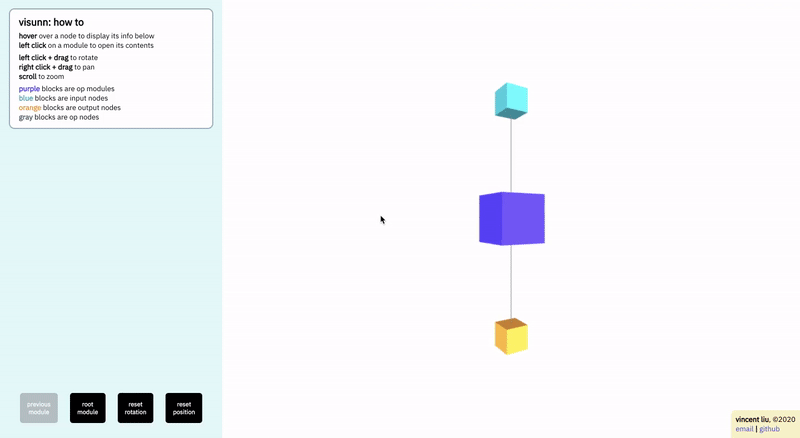

# Visunn: Aesthetic Visualizations of Neural Networks for Deep Learning
Visunn is a visualization tool that leverages functional and modular visualizations to provide an visual understanding of neural network architectures. Currently, `torch>=1.4.0` backend is supported.



## Setup
The backend and user API is in Python (all `pip` dependencies can be found in `requirements.txt`) and serves a frontend consisting of a fusion of React and Three.js (all `npm` dependencies can be found in `visunn/frontend/package.json`).

## Usage
The following examples will use the model `models/ThreeLayerMLP`.

### To pip install
1. Install python package
```bash
pip install visunn
```
2. Initialize `Visu` in Python script
```python
from visunn import Visu
visu = Visu(model, dataloader, logdir='logs', name='ThreeLayerMLP')
```
3. Launch web app
```bash
visu -l logs -n ThreeLayerMLP -p 5000
```
### To use source
1. Build frontend (requires `npm`)
```bash
sh build.sh
```
2. Initialize `Visu`
```bash
python samples/train.py -l logs -n ThreeLayerMLP
```
3. Launch web app
```
python samples/serve.py -l logs -n ThreeLayerMLP -p 5000
```

## Metrics
Below are time and space metrics for a few sample models, averaged over 5 runs. These can be obtained by running `python samples/debug.py`, which prints metrics of the 5 steps required to create a modularized topology (run on CIFAR-10):
 > Step 1 is the largest bottlenecks in the algorithm.
1. Convert model to protobuf (built in Pytorch function)
2. Convert protobuf to dict
3. Prune trivial nodes
4. Prune trivial modules
5. Build modularized topology

| Model              | Step 1   | Step 2  | Step 3  | Step 4  | Step 5  | Space     |
|--------------------|----------|---------|---------|---------|---------|-----------|
| ThreeLayerMLP      |  0.042 s | 0.001 s | 0.000 s | 0.000 s | 0.000 s |  32.37 kb |
| ThreeLayerConvNet  |  0.051 s | 0.002 s | 0.000 s | 0.000 s | 0.000 s |  35.33 kb |
| resnet18           |  1.282 s | 0.016 s | 0.002 s | 0.001 s | 0.002 s | 335.40 kb |
| resnet152          |  6.819 s | 0.115 s | 0.065 s | 0.005 s | 0.013 s |   2.14 Mb |
| densenet121        |  4.143 s | 0.103 s | 0.045 s | 0.008 s | 0.017 s |   1.94 Mb |
| densenet201        |  7.528 s | 0.174 s | 0.125 s | 0.015 s | 0.034 s |   3.56 Mb |
| googlenet          |  2.241 s | 0.046 s | 0.011 s | 0.001 s | 0.011 s | 941.52 kb |
| shufflenet_v2_x2_0 |  2.289 s | 0.070 s | 0.023 s | 0.007 s | 0.010 s |   1.07 Mb |
| mobilenet_v2       |  1.685 s | 0.045 s | 0.009 s | 0.003 s | 0.005 s | 674.06 kb |
| resnext101_32x8d   | 11.744 s | 0.085 s | 0.033 s | 0.004 s | 0.009 s |   1.35 Mb |
| wide_resnet101_2   | 13.495 s | 0.002 s | 0.165 s | 0.007 s | 0.054 s |   1.10 Mb |
| mnasnet1_3         |  1.562 s | 0.042 s | 0.008 s | 0.003 s | 0.005 s | 658.74 kb |

## Notes
This section is dedicated to address nuances that come with the Pytorch backend.

### Recycled Layers
This problem is exemplified with the following following variation of `ThreeLayerMLP`:
```python
class Model(nn.Module):
    def __init__(self, num_classes=10, **kwargs):
        self.flatten = nn.Flatten(1, -1)
        self.linear1 = nn.Linear(32*32*3, 1024, bias=True)
        self.linear2 = nn.Linear(1024, 256, bias=True)
        self.linear3 = nn.Linear(256, num_classes, bias=True)
        self.relu = nn.ReLU()

    def forward(self, x):
        x = self.flatten(x)
        x = self.linear1(x)
        x = self.relu(x)
        x = self.linear2(x)
        x = self.relu(x)
        x = self.linear3(x)
        return x
```
Note how `self.relu = nn.ReLU()` is reused multiple times. While this is not incorrect in any way. However, from a graph perspective, there is one `self.relu = ReLU()` node, which has multiple input and output nodes. Rendering this topology declaration will show cycles in the graph due to the multiple passes through the recycled node. A potential solution would be to split all nodes that consist of >1 unconnected graph.

### Weights and Biases
With how `torch>=1.4.0` constructs the graph protobuf, it is not possible to acquire the `_output_shapes` attribute from the weights and biases nodes (recoverable for all other nodes). Those fields empty when aggregating attributes.
